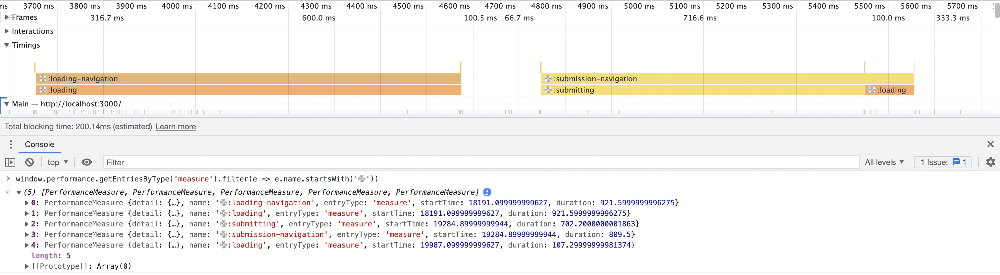

# remix-use-spa-metrics

Custom hook for tracking client-side navigation performance in Remix/React-Router applications

## Motivation

The [current performance landscape](https://web.dev/vitals/#core-web-vitals) focuses primarily on SSR metrics, but largely ignores any standardized set of metrics for subsequent SPA navigations. This is understandable since the approach used for SPA navigations varies so much from app to app that it would likely be incredibly hard to come up with a one-size-fits-all set of metrics.

However, if you're building a universal app that SSR's and then hydrates into a SPA - that SSR page load may only account for a small percentage of your users page loads in their session. Shouldn't we also be looking at the stats for page loads 2 through N?

This custom hook aims to help facilitate your own standardized set of measurements for your Remix/React-Router (>=6.4.0) by leveraging the [`useNavigation`](https://beta.reactrouter.com/en/v6.4.0-pre.2/hooks/use-navigation) hook (`useTransition` in Remix) which tells you when your application is performing a SPA navigation between pages.

You can then send the data off to whatever performance tracking setup you use. In a former life, I did this through [Blue Tringle Custom Timers](https://help.bluetriangle.com/hc/en-us/articles/360039526094-Custom-Timer-Implementation).

## Installation

```bash
npm install remix-use-spa-metrics
# or
yarn add remix-use-spa-metrics
```

## Usage

The best way to leverage this is to put a single root layout wrapper around your entire application, and then wire up the hook a single time in the root:

```jsx
import { useSpaMetrics } from "remix-use-spa-metrics";

function RootLayout() {
  let location = useLocation();
  let navigation = useNavigation();
  let callback = React.useCallback((data) => {
    // This function is called once at the end of each navigation
  }, []);

  useSpaMetrics(location, navigation, callback);
  ...
}
```

Then, you can use the callback function to send the data off to your
performance tracking service. The `data` parameter is of the following shape:

```typescript
interface CallbackData {
  type: "submitting" | "loading";
  fromLocation: Location;
  toLocation: Location;
  finalLocation: Location;
  submissionDuration?: number;
  loadingDuration: number;
  totalDuration: number;
}
```

On standard `<Link>` navigations, you'll get an approximately equal `loadingDuration` and `totalDuration`. Non-GET `<Form>` submissions will provide a `submissionDuration` and a `loadingDuration` that will sum up to `totalDuration`

`fromLocation` and `toLocation` provide the `useLocation()` and `useNavigation().location` values from the start of the navigation. `finalLocation` reflects the final `useLocation()` when we return to an `idle` state since we may have redirected a few times while in the `loading` state.

Eventually, this hook may provide more granular detail about encountered redirects and subsequent load times but for now we view "navigations" from the user's eyes - as a single duration from the moment they click a Link or submit a Form until they are viewing the resulting page.

### `window.performance.mark` and `window.performance.measure`

Under the hood, this is all implemented using the [`window.performance.mark`](https://developer.mozilla.org/en-US/docs/Web/API/Performance/mark) and [`window.performance.measure`](https://developer.mozilla.org/en-US/docs/Web/API/Performance/measure) APIs, so you automatically get the built-in dev tools functionality there, such as showing the measurements in the Profiler and access to your individual marks via `window.performance.getEntries*`:



All performance entries start with 💿 so you can leverage that to programmatically query for them:

```
// Get all entries
window.performance.getEntries().filter(e => e.name.startsWith('💿'))

// Get all marks
window.performance.getEntriesByType('mark').filter(e => e.name.startsWith('💿'))

// Get all measures
window.performance.getEntries('measure').filter(e => e.name.startsWith('💿'))
```
